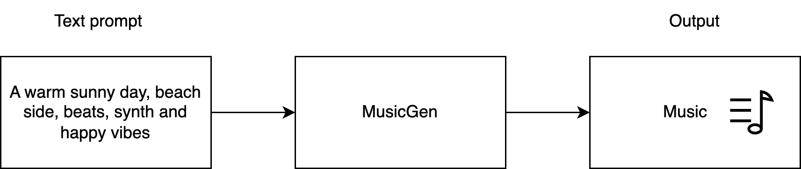
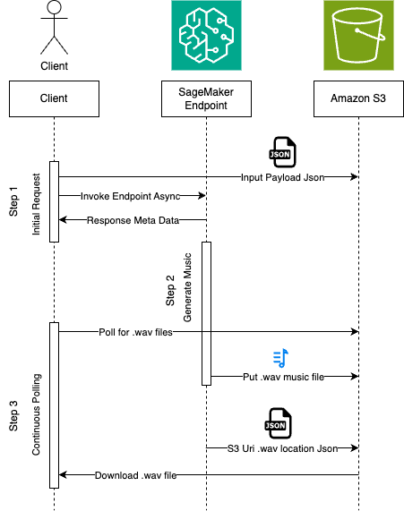

## Inference Audiocraft Musicgen on Amazon SageMaker

Deploy Audiocraft Musicgen on Amazon SageMaker using SageMaker Endpoints for Async Inference. 

This solution demonstrates deploying AudioCraft MusicGen models from HuggingFace on Amazon SageMaker. MusicGen models take natural language text as input prompt and generate music as output.



AudioCraft consists of three models: MusicGen, AudioGen, and EnCodec. This repo aims to deploy MusicGen models on Amazon SageMaker for Asynchronous inferencing.

## Solution Overview


1. The users interacts with SageMaker Async Endpoint with the help of SageMaker Studio notebook.
2. The input payload is placed on S3 bucket for inference, generated music will be downloaded from S3 bucket.
3. The deployment and inference happens to Amazon SageMaker Asynchronous endpoint.
4. The [HuggingFace Inference Containers](https://github.com/aws/deep-learning-containers/blob/master/available_images.md#huggingface-inference-containers) image will be used as a base image. We will use the image that supports PyTorch 2.1.0 with HuggingFace transformers framework.
5. The SageMaker HuggingFaceModel will be deployed on SageMaker Async endpoint.
6. The HuggingFace model, facebook/musicgen-large in the scope of this blog, will be downloaded to S3 during the deployment. Also, during the inference the generated outputs will be placed on S3.
7. Amazon SNS topics to indicate the success and failure are defined as a part of SageMaker async inference configuration.

## Asynchronous Inference Sequence flow for huggingface model facebook/musicgen-large on Amazon SageMaker



## Deployment and inference notebooks

The deployment notebooks used in this repo uses Huggingface as model provider for the musicgen models. The corresponding deployment and inference noteboks for the respective models are tablulated below.

| Huggingace Model ID | Deploy Notebook | Inference Notebook |
| -- | -- | -- |
| facebook/musicgen-large | [Deploy](musicgen-large/deploy-musicgen-large.ipynb) | [Inference](musicgen-large/infer-async.ipynb) |
| facebook/musicgen-medium | [Deploy](musicgen-medium/deploy-musicgen-medium.ipynb) | [Inference](musicgen-medium/infer-async.ipynb) |
| facebook/musicgen-small | [Deploy](musicgen-small/deploy-musicgen-small.ipynb) | [Inference](musicgen-small/infer-async.ipynb) |

## References
- [Open sourcing AudioCraft: Generative AI for audio made simple and available to all](https://ai.meta.com/blog/audiocraft-musicgen-audiogen-encodec-generative-ai-audio/)
- https://huggingface.co/facebook/musicgen-large
- https://huggingface.co/docs/transformers/model_doc/musicgen#generation
- https://github.com/facebookresearch/audiocraft/blob/main/README.md
- https://sagemaker.readthedocs.io/en/stable/frameworks/huggingface/sagemaker.huggingface.html#hugging-face-model
- https://sagemaker.readthedocs.io/en/stable/api/inference/predictors.html#sagemaker.predictor.Predictor.predict
- https://github.com/aws/amazon-sagemaker-examples/blob/main/async-inference/Transcription_on_SM_endpoint.ipynb


## Security

See [CONTRIBUTING](CONTRIBUTING.md#security-issue-notifications) for more information.

## Citation
```
@inproceedings{copet2023simple,
    title={Simple and Controllable Music Generation},
    author={Jade Copet and Felix Kreuk and Itai Gat and Tal Remez and David Kant and Gabriel Synnaeve and Yossi Adi and Alexandre Défossez},
    booktitle={Thirty-seventh Conference on Neural Information Processing Systems},
    year={2023},
}
```

## License

This library is licensed under the MIT-0 License. See the LICENSE file.

